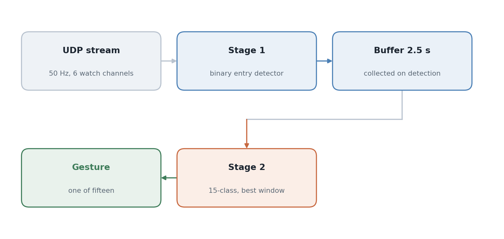

# IMU Gesture Classifier

Yuhyeon Lee · 2025

[](https://github.com/blueion0612/IMU_Gesture_Classifier/actions/workflows/tests.yml)
[](LICENSE)
[](https://www.python.org/)
[](#limitations)

[**Method**](#method) · [**Data**](#data) · [**Streaming app**](https://github.com/wearable-motion-capture/sensor-stream-apps)

<picture>
  <source media="(prefers-color-scheme: dark)" srcset="docs/figures/hero_pipeline-dark.png">
  
</picture>

**IMU Gesture Classifier** recognises fifteen hand gestures from a smartwatch, live,
using only the watch's accelerometer and gyroscope. Detection and classification are
split: a cheap binary model watches the stream continuously and decides when a
gesture has started, and only then does a fifteen-class model run on the 2.5 seconds
that follow.

## Results

No benchmark numbers are committed to this repository, so none are claimed here.
Training writes its own, and the protocol that produces them is fixed:

| Setting | Value |
|---|---|
| Split | 70 / 15 / 15, train / validation / test |
| Seed | 42 |
| Early stopping | 15 epochs without improvement, maximum 1000 |
| Batch size | 64 for stage 1, 32 for stage 2 |
| Learning rate | 1e-3 |
| Reported metrics | accuracy and macro F1, plus a confusion matrix |

Both training scripts sweep every model in the table below and write the full grid,
not the winner alone, to `gesture_data/reports/stage{1,2}_results.csv` with matching
plots. Read those rather than trusting a summary.

| Model | Description |
|---|---|
| `mlp` | Multi-layer perceptron over the flattened window |
| `lstm` | LSTM |
| `gru` | GRU |
| `tcn` | Temporal convolutional network |
| `cnn1d` | 1D convolutional network |
| `cnn_lstm` | Convolutional front end into a bidirectional LSTM |

## Quick start

```bash
pip install -r requirements.txt
```

Download `gesture_data/` (see [Data](#data)), then:

```bash
# grid search, stage 1: when does a gesture begin
python -m imu_gesture.train_stage1

# grid search, stage 2: which gesture was it
python -m imu_gesture.train_stage2

# live recognition
python -m imu_gesture.inference \
    --stage1 gesture_data/models/stage1_lstm_w1.0_s0.5.pt \
    --stage2 gesture_data/models/stage2_tcn_seq100.pt
```

## Method

**Why two stages.** A fifteen-class model run continuously on a sliding window has to
decide, at every step, both whether anything is happening and what it is. Splitting
those questions lets the first model stay small enough to run on every window while
the second sees a complete gesture rather than a fragment of one.

**Stage 1, entry detection.** A binary model over a sliding window of the six watch
channels. The window length and stride are part of the grid search, not fixed in
advance.

**Stage 2, classification.** A detection opens a 2.5 second buffer. The classifier is
then run over several windows inside that buffer and the highest-confidence result
wins, so the gesture does not have to start exactly where the detector fired.

**Channels.** Six, all from the watch: linear acceleration and angular rate in three
axes each. The phone's sensors are received but not used for training.

**Cooldown.** After a recognised gesture the detector is suppressed for a
configurable interval, two seconds by default, so that one movement cannot produce a
burst of detections.

## Usage

**Record training data.** The collector has two modes, one per stage:

```bash
python -m imu_gesture.collector continuous <PHONE_IP> --duration 60   # stage 1
python -m imu_gesture.collector fragment <PHONE_IP>                   # stage 2
```

**Inspect what you recorded** before training on it:

```bash
python -m imu_gesture.stats
```

**Inference options:** `--ip` and `--port` for the UDP socket, `--cooldown` for the
suppression interval, `--collect_sec` for the stage 2 buffer length.

## Repository layout

```
imu_gesture/
  config.py          channel map, gesture labels, split ratios, paths
  collector.py       UDP capture, continuous and fragment modes
  stats.py           dataset summaries and distribution plots
  train_stage1.py    entry detector, grid search over window and model
  train_stage2.py    15-class model, grid search over model
  inference.py       live recognition from the stream
tests/               channel map and model shape checks
docs/figures/        README figure and the script that draws it
gesture_data/        recordings, checkpoints and reports, not in git
```

## Tests

Eight tests, none of which need recordings or a checkpoint. They check that the
channel map is a complete 55-entry layout with no gaps, that the six training
channels resolve to the right indices, that the gesture labels are contiguous and
unique, that the split ratios sum to one, and that every advertised model builds and
returns one logit per sample for stage 1 and fifteen per sample for stage 2.

```bash
pytest -q                    # if pytest is installed
python tests/test_models.py  # works without it
```

## Data

Recordings, pretrained checkpoints and the training reports are on
[Google Drive](https://drive.google.com/drive/folders/1mgxz30EclogKA0BMhB4Qonne6MmlWgjL?usp=sharing).
Unpack `gesture_data/` into the repository root:

```
gesture_data/
  continuous/detection/    stage 1 recordings
  gestures/fragments/      stage 2 recordings
  models/                  checkpoints
  reports/                 result tables and plots
```

**The packet format matters.** This collector expects **55 big-endian floats** on UDP
65000, which is the layout of
[wearable-motion-capture/sensor-stream-apps](https://github.com/wearable-motion-capture/sensor-stream-apps).
The sibling repository
[IMU_Stream_APP_MJU](https://github.com/blueion0612/IMU_Stream_APP_MJU) sends a
reduced **30-float** packet and is therefore **not** a drop-in source: pointing this
collector at it captures nothing, because the length check rejects every datagram.
Using it would mean rewriting the channel map in `config.py` and re-recording, since
the two layouts order their fields differently.

## Limitations

- **No committed results.** The reports live with the data, so the repository alone
  proves nothing about accuracy.
- **Gesture set is fixed at fifteen** in `config.py`, and the checkpoints are tied to
  it. Adding a gesture means retraining both stages.
- **Single wearer.** Nothing here evaluates whether the models transfer to another
  person's movements.
- **The 2.5 second buffer bounds gesture length.** Anything slower is truncated.
- **UDP with no sequence number**, so dropped packets shorten a window silently.

## Citation

```bibtex
@misc{lee2025imugesture,
  author = {Yuhyeon Lee},
  title  = {IMU Gesture Classifier: two-stage gesture recognition from smartwatch inertial data},
  year   = {2025},
  note   = {Unpublished. https://github.com/blueion0612/IMU_Gesture_Classifier}
}
```

## License

MIT. See [LICENSE](LICENSE).
